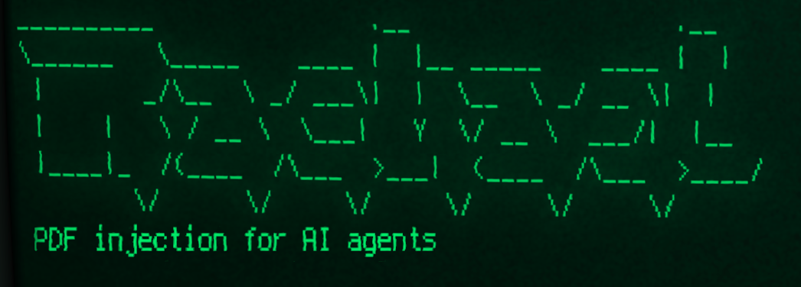

<!-- PROJECT LOGO -->
 

  

  <h3 align="center">THIS PROJECT IS CURRENTLY UNDER CONSTRUCTION!</h3>
  
  

    Demonstration of injecting data into a PDF to make an AI agent perform actions.
     
    <a href="https://antoinemeheut.github.io/Rachael/">Documentation</a>
    ·
    <a href="https://github.com/AntoineMeheut/blogame/issues">Report Bug</a>
    ·
    <a href="https://github.com/AntoineMeheut/blogame/projects">Request Feature</a>
  

<!-- PROJECT SHIELDS -->
[![Contributors][contributors-shield]][contributors-url]
[![Forks][forks-shield]][forks-url]
[![Stargazers][stars-shield]][stars-url]
[![Issues][issues-shield]][issues-url]
[![GNU License][license-shield]][license-url]

<!-- TABLE OF CONTENTS -->
# Table of Contents

* [Warning](#warning)
* [About the Project](#about-the-project)
	* [Videos](#videos)
    * [My goals](#my-goals)
	* [Features](#features)
* [Installation](#installation)
    * [Install n8n](#install-n8n)
    * [Install ollama](#install-ollama)
    * [Create the AI agent](#create-the-AI-agent)
    * [Demonstration setup](#demonstration-setup)
    * [Demonstration execution](#demonstration-execution)
* [Contributing](#contributing)
* [License](#license)
* [Credit](#credit)
* [Contact](#contact)

<!-- WARNING -->
# Warning

- I am not demonstrating vulnerabilities in [Ollama](https://ollama.ai) or [n8n](https://n8n.io/) tools; these two tools are very good products, which also allow for local installation,
- What I am demonstrating is the possibility of command injection for an AI agent into a PDF file,
- At the end of this demonstration, you will find an example of how to properly use the n8n tool to counter command injections into PDF files,
- Finally, do not reproduce this demonstration except for training and understanding the mechanisms and tools.

<!-- ABOUT THE PROJECT -->
# About this project
## Videos
https://github.com/user-attachments/assets/4d2b1686-8c2c-4db9-b20f-e66310d3571d

 

  
  

## My goals
 Testing data injection into a PDF to trigger actions in an AI agent.

To carry out this test, I established the following prerequisites:

- Not having to register to use workflow and AI tools, therefore requiring local solutions,
- Not having to pay for a subscription to an AI or workflow service, to allow everyone to reproduce this example,
- Identifying an open-source AI capable of analyzing a resume and using tools to automatically send emails,
- Identifying a way to discreetly inject text into a PDF to give counter-instructions to the AI agent analyzing the PDF,
- And finally, getting all of this to work on a laptop.

Meeting these prerequisites wasn't always easy; I'll explain this in more detail later.

## Features of this demonstration

- Install and use AI locally,
- Install and use a workflow tool locally that uses AI,
- Create an AI agent that reads resumes, evaluates them, and sends emails to candidates,
- Inject instructions for the AI agent into a PDF file.

# Installation

## Install n8n

To use local workflows, I chose to install n8n.

They have a really quick installation procedure based on using Docker Desktop; you can find it [here](https://docs.n8n.io/hosting/installation/docker/). When installing n8n locally, you'll need to consider your target architecture. Either have n8n and Ollama installed and started with Docker [n8n Starter Kit](https://docs.n8n.io/hosting/starter-kits/ai-starter-kit/), or have Ollama separately.

My choice here is to have Ollama separately, as I use it with other projects not running in Docker.

For n8n, I chose to install and launch it with Docker Desktop. This has the following impact: for n8n in Docker to call Ollama, I have to give to n8n the following address to access my local Ollama: http://host.docker.internal:11434/

## Install ollama

To use local models, I chose to install Ollama. 

Navigate to the [Ollama's Download page](https://ollama.ai/download) and follow the installation instructions.

## Create the AI agent

n8n workflows can be saved in json format; you can find the json file for this demonstration [agent demo](/resources/n8n_json_demo/demo.json), import it into your n8n instance.

## Demonstration setup

You will need to adapt certain steps of the workflow you just imported into the n8n tool to make the demonstration work.

### 
## Demonstration execution

## A closer look at Eve's CV

<!-- CONTRIBUTING -->
# Contributing

Contributions are what make the open source community such an amazing place to be learn, inspire, and create.
Any contributions you make are **greatly appreciated**.

1. Fork the Project
2. Create your Feature Branch (`git checkout -b feature/AmazingFeature`)
3. Commit your Changes (`git commit -m 'Add some AmazingFeature'`)
4. Push to the Branch (`git push origin feature/AmazingFeature`)
5. Open a Pull Request

<!-- LICENSE -->
# License

Distributed under the MIT License. See `LICENSE` for more information.

<!-- CREDIT -->
# Credit
In homage to one of my favorite science fiction films: Blade Runner, directed by Ridley Scott and released in 1982.

This project is inspired by the following project: https://github.com/greshake/llm-security

<!-- CONTACT -->
# Contact

If you want to contact me [just clic](mailto:github.contacts@protonmail.com)

Project Link: [https://github.com/AntoineMeheut/Rachael](https://github.com/AntoineMeheut/Rachael)

<!-- MARKDOWN LINKS & IMAGES -->
<!-- https://www.markdownguide.org/basic-syntax/#reference-style-links -->
[contributors-shield]: https://img.shields.io/github/contributors/AntoineMeheut/Rachael?color=green
[contributors-url]: https://github.com/AntoineMeheut/Rachael/graphs/contributors
[forks-shield]: https://img.shields.io/github/forks/AntoineMeheut/Rachael
[forks-url]: https://github.com/AntoineMeheut/Rachael/network/members
[stars-shield]: https://img.shields.io/github/stars/AntoineMeheut/Rachael
[stars-url]: https://github.com/AntoineMeheut/Rachael/stargazers
[issues-shield]: https://img.shields.io/github/issues/AntoineMeheut/Rachael
[issues-url]: https://github.com/AntoineMeheut/Rachael/issues
[license-shield]: https://img.shields.io/github/license/AntoineMeheut/Rachael
[license-url]: https://github.com/AntoineMeheut/Rachael/blob/main/LICENSE

